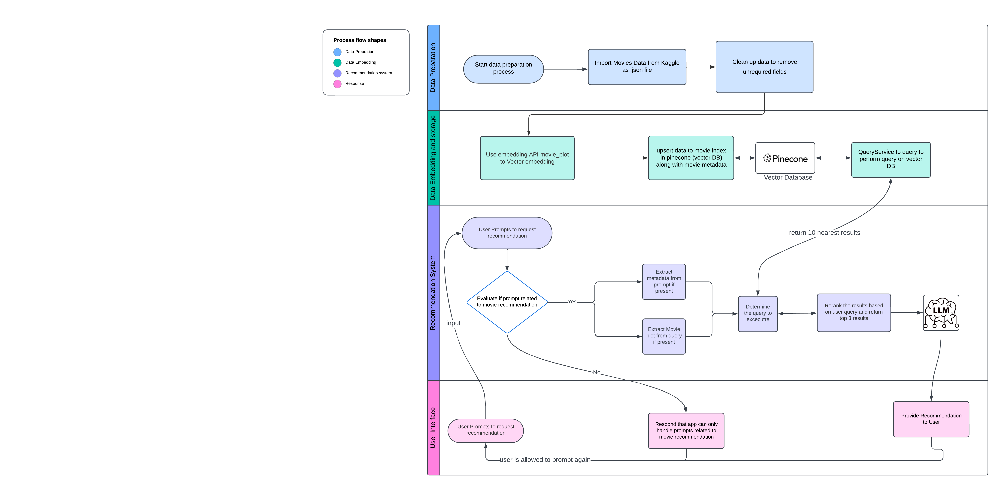

# Viewing Recommendation System - Retrieval-Augmented Generation

**Checkout the report here: https://github.com/varun-jayakumar/viewing_recommendation_system/blob/main/report.pdf**
**Check out the video on youtube: https://www.youtube.com/watch?v=SHPHw-bd3sw**

[](https://www.youtube.com/watch?v=SHPHw-bd3sw)

## 🔍 Project Overview

This project aims to create a recommendation system that suggests personalized content to users based on their preferences and historical data. It utilizes various algorithms and models to generate accurate and relevant recommendations.

## 🎯 How does the Recommendation System work?



## 🎯 EntryPoint: recommendation_system/app.py

This file is the main entry point of the application. It serves as the backbone of the recommendation system. It contains the logic and functionality to process user input, retrieve data from the database, and generate personalized recommendations based on various algorithms and models.

The `app.py` file handles the routing and request handling for different endpoints of the application. It interacts with other modules and libraries to perform tasks such as user authentication, data preprocessing, feature extraction, and recommendation generation.

By executing `app.py`, the application starts running and listens for incoming requests. It then processes these requests, performs the necessary computations, and returns the appropriate responses to the users.

In summary, `app.py` is responsible for orchestrating the entire recommendation system, ensuring smooth user experience, and delivering accurate and relevant recommendations based on the user's preferences and historical data.

## 🎯 queryService.py

The `queryService.py` file handles the querying of the recommendation system. It interacts with the database and retrieves relevant data based on user queries.

## 🎯 rankingService.py

The `rankingService.py` file is responsible for ranking the recommendations generated by the recommendation system. It applies ranking algorithms to ensure that the most relevant recommendations are presented to the users.

## 🎯 embeddingService.py

The `embeddingService.py` file is responsible for generating embeddings of the content in the recommendation system. It uses advanced techniques to represent the content in a high-dimensional space, enabling efficient similarity calculations and recommendation generation.

The `README.md` file provides detailed information about the project, including its purpose, features, installation instructions, and usage guidelines. It serves as a comprehensive guide for developers and users who want to understand and work with the project. 📖

## Features ✨

- 🧹Data preprocessing: The project includes modules for cleaning, transforming, and preparing the data for recommendation generation.
- 🎬 Recommendation generation: The system employs advanced algorithms to generate personalized recommendations for each user.
- 🎥 RAG implementation with Vector DB - on query service to recommend movies

## Installation 🛠️

To install and run the project locally, follow these steps:

1. Clone the repository: `git@github.com:varun-jayakumar/viewing_recommendation_system.git`
2. Navigate to the project directory: `cd recommendation_system`
3. Install the dependencies: `pip install -r requirements.txt`
4. create `.env`
5. Run the application: `streamlit run app.py`

## 🗝️ Example .env

```
OPEN_API_KEY=""
PINECONE_APIKEY=""
JINA_APIKEY=""
```

## Usage 🚀

Once the project is installed and running, users can access the application through their web browser. They can create an account, log in, and start receiving personalized recommendations based on their preferences. 🌟

## License 📄

This project is licensed under the MIT License. See the [LICENSE](LICENSE) file for more information. 📝

## Contact 📧

If you have any questions or suggestions regarding this project, feel free to contact us at jayakumar.va@northeastern.edu 📬
